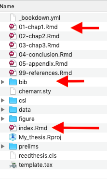
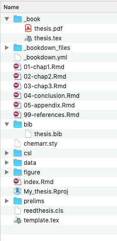

```{r setup, include=FALSE}
library(knitr)
options(htmltools.dir.version = FALSE)
opts_chunk$set(
  warning = FALSE,
  message = FALSE,
  echo = FALSE,
  cache.path = 'cache/',
  fig.align = 'center',
  cache = FALSE
)
library(anicon)

```
```{r xaringan-themer, include=FALSE, warning=FALSE}
library(xaringanthemer)
style_mono_accent(
   base_color = "#002c54",
   title_slide_background_color = "#031642",
  inverse_background_color = "#002c54",
  header_font_google = google_font("Josefin Sans"),
  text_font_google   = google_font("Montserrat", "300", "300i"),
  code_font_google   = google_font("Fira Mono"),
  title_slide_text_color = "#ffea00",
  inverse_header_color = "#ffea00",
   header_background_text_color = "#ffea00",
   text_font_size = "1.2rem",
   text_font_url = "#ffea00",
  header_font_url = "#ffea00",
  inverse_link_color = "#d70dde"
  )
```

class: inverse, middle, center
# bookdown R package

```{r   out.width = "20%", echo = FALSE, fig.cap=''}
knitr::include_graphics("fig/bookdown.png")

```

- A open-source R package to facilitate writing books and long-form articles/reports with R Markdown.

- Generate printer-ready books and ebooks from R Markdown documents
]
---
class: inverse, middle, center
.pull-left[
```{r   out.width = "85%", echo = FALSE, fig.cap=''}


```
].pull-right[

```{r   out.width = "100%", echo = FALSE, fig.cap=''}
knitr::include_graphics("fig/thesiscode.png")

```
]

---

class: inverse, middle, center

.pull-left[
```{r   out.width = "75%", echo = FALSE, fig.cap=''}
knitr::include_graphics("fig/bookdowncover.jpeg")

```
].pull-right[
## Learn more about bookdown:

https://pkgs.rstudio.com/bookdown/


```{r   out.width = "50%", echo = FALSE, fig.cap=''}
knitr::include_graphics("fig/bookdown.png")

```

You can install the package from CRAN as follows:

install.packages("bookdown")
]

---

class: inverse, middle, center

# thesisdown

```{r   out.width = "35%", echo = FALSE, fig.cap=''}
knitr::include_graphics("fig/thesisdownlogo1.png")

```

Inspired by the bookdown package

<!--This project was inspired by the bookdown package-->

---

## Prerequisites 


- To compile PDF documents using R, you are going to need to have LaTeX installed.

- By far the easiest way to install LaTeX on any platform is with the `tinytex` R package:

```{r eval=FALSE, echo=TRUE}
install.packages(c('tinytex', 'rmarkdown'))
tinytex::install_tinytex()
# after restarting RStudio, confirm that you have LaTeX with
tinytex:::is_tinytex()
```
--

- Install the `bookdown` and `thesisdown` packages.

```{r eval=FALSE, echo=TRUE}

if (!require("remotes")) 
  install.packages("remotes", repos = "https://cran.rstudio.org")
remotes::install_github("rstudio/bookdown")
remotes::install_github("ismayc/thesisdown")
```

- Note that {thesisdown} is not available on CRAN at the moment and that’s why `install.packages("thesisdown")` won’t work.

---
class: inverse, middle, center

# Tip

### You may need to restart RStudio at this point for the following dialog to show up.
---

File > New Project > New Directory

Then select **Thesis Project using thesisdown**
from the dropdown

```{r   out.width = "70%", echo = FALSE, fig.cap=''}


```
---

Give your project a name and specify where you’d like the files to appear

```{r   out.width = "70%", echo = FALSE, fig.cap=''}


```

---

## Directory structure

.pull-left[

```{r   out.width = "60%", echo = FALSE, fig.cap=''}


```
].pull-right[
`index.Rmd`: Contains your YAML (metadata) that will tell bookdown how to render your book


`.Rmd files` that comprise the body of your book

`thesis.bib` is a bib file containing your references. Most popular reference management tools have the option to export your references to a .bib file.
]

---

```{r   out.width = "100%", echo = FALSE, fig.cap=''}


```


---

.pull-left[
```{r   out.width = "60%", echo = FALSE, fig.cap=''}


```

].pull-right[

[Generated thesis](https://github.com/RETINALAB/rmd_workshop_with_blogdown/blob/master/static/slides/3Thesisdown/fig/thesis.pdf)

```{r   out.width = "60%", echo = FALSE, fig.cap=''}


```

[To learn more about different thesis templates visit https://github.com/ismayc/thesisdown](https://github.com/ismayc/thesisdown)
]

---
class: inverse, middle, center

# Coming Soon !!

`r anicon::faa("bell", animate="ring", size =3, speed = "fast")`

## morathesisdown

An R Markdown thesis template for the University of Moratuwa

Development version  at : "https://github.com/RETINALAB/morathesisdown"

---
# morathesisdown

.pull-left[
```{r   out.width = "70%", echo = FALSE, fig.cap=''}


```

].pull-right[

```{r   out.width = "70%", echo = FALSE, fig.cap=''}


```

]

---
class: inverse, middle, center

```{r}
icon::fa("github")
icon::fa("twitter")

```
pridiltal and thiyangt

# Acknowledgements:

This work was supported in part by RETINA research lab funded by the OWSD, a program unit of United Nations Educational, Scientific and Cultural Organization (UNESCO).


All rights reserved by Thiyanga S. Talagala and Priyanga D Talagala


