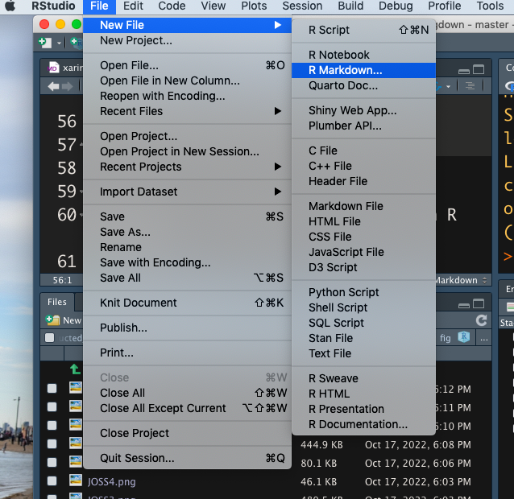
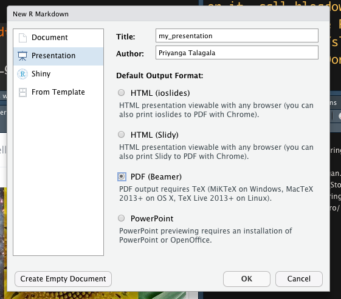
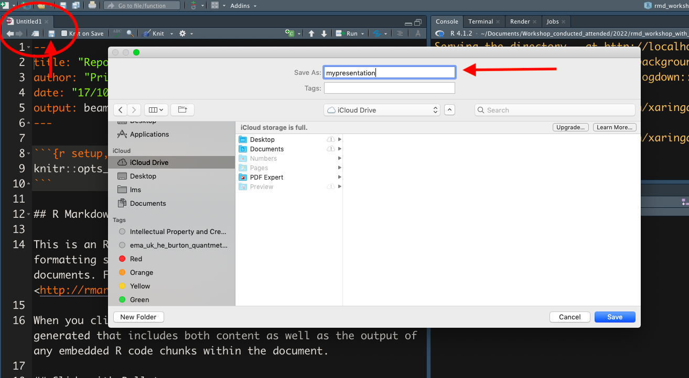
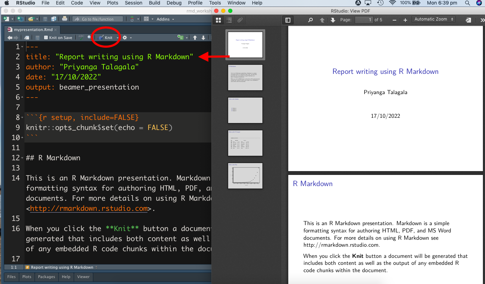
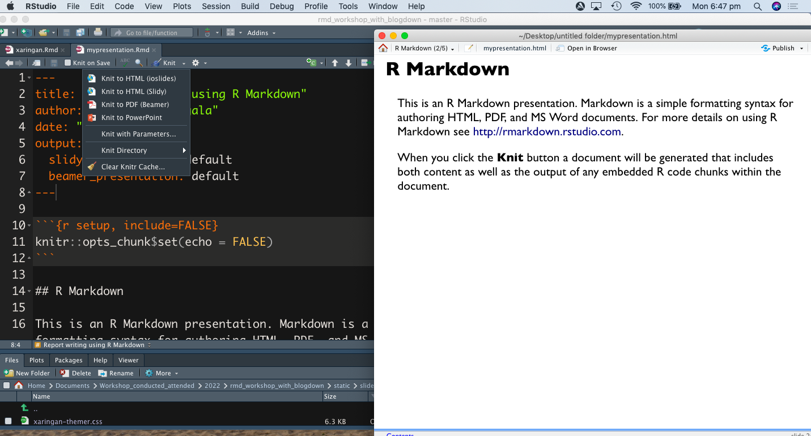
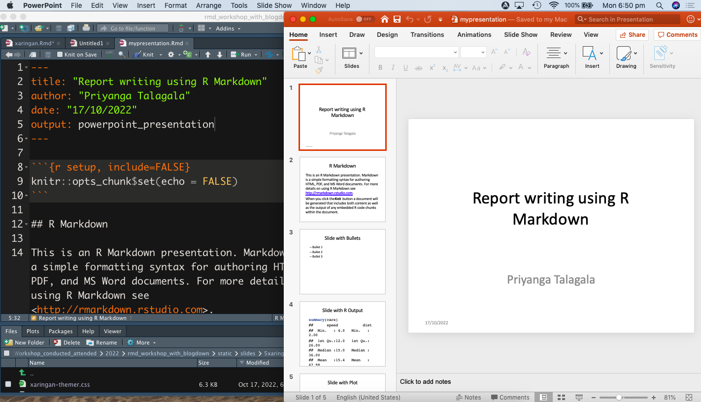
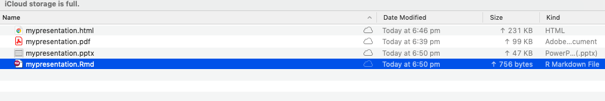

```{r setup, include=FALSE}
library(knitr)
options(htmltools.dir.version = FALSE)
opts_chunk$set(
  warning = FALSE,
  message = FALSE,
  echo = FALSE,
  cache.path = 'cache/',
  fig.align = 'center',
  cache = FALSE
)
library(anicon)

```
```{r xaringan-themer, include=FALSE, warning=FALSE}
library(xaringanthemer)
style_mono_accent(
   base_color = "#002c54",
   title_slide_background_color = "#031642",
  inverse_background_color = "#002c54",
  header_font_google = google_font("Josefin Sans"),
  text_font_google   = google_font("Montserrat", "300", "300i"),
  code_font_google   = google_font("Fira Mono"),
  title_slide_text_color = "#ffea00",
  inverse_header_color = "#ffea00",
   header_background_text_color = "#ffea00",
   text_font_size = "1.2rem",
   text_font_url = "#ffea00",
  header_font_url = "#ffea00",
  inverse_link_color = "#d70dde"
  )
```

class: inverse, middle, center
# Method 1: Presentation slides with R Markdown

```{r   out.width = "30%", echo = FALSE, fig.cap=''}
knitr::include_graphics("fig/rmarkdown.png")

```

---
### Method 1: Presentation slides with R Markdown

```{r   out.width = "50%", echo = FALSE, fig.cap=''}


```

---

### Method 1: Presentation slides with R Markdown

```{r   out.width = "60%", echo = FALSE, fig.cap=''}


```

---

### Method 1: Presentation slides with R Markdown

```{r   out.width = "100%", echo = FALSE, fig.cap=''}


```
---

### Method 1: Presentation slides with R Markdown

#### PDF output

```{r   out.width = "70%", echo = FALSE, fig.cap=''}


```

---
### Method 1: Presentation slides with R Markdown

#### HTML output

```{r   out.width = "80%", echo = FALSE, fig.cap=''}


```
---
### Method 1: Presentation slides with R Markdown

#### Powerpoint Presentation

```{r   out.width = "70%", echo = FALSE, fig.cap=''}


```
---

### Method 1: Presentation slides with R Markdown  

```{r   out.width = "90%", echo = FALSE, fig.cap=''}


```

---
class: inverse, middle, center

```{r}
icon::fa("github")
icon::fa("twitter")

```
pridiltal and thiyangt

# Acknowledgements:

This work was supported in part by RETINA research lab funded by the OWSD, a program unit of United Nations Educational, Scientific and Cultural Organization (UNESCO).


All rights reserved by Thiyanga S. Talagala and Priyanga D Talagala


