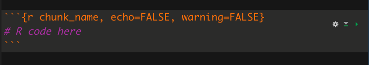

```{r setup, include=FALSE}
library(knitr)
options(htmltools.dir.version = FALSE)
opts_chunk$set(
  warning = FALSE,
  message = FALSE,
  echo = FALSE,
  cache.path = 'cache/',
  fig.align = 'center',
  cache = FALSE
)
library(anicon)

```
```{r xaringan-themer, include=FALSE, warning=FALSE}
library(xaringanthemer)
style_mono_accent(
   base_color = "#002c54",
   title_slide_background_color = "#031642",
  inverse_background_color = "#002c54",
  header_font_google = google_font("Josefin Sans"),
  text_font_google   = google_font("Montserrat", "300", "300i"),
  code_font_google   = google_font("Fira Mono"),
  title_slide_text_color = "#52ecf7",
  inverse_header_color = "#ffea00",
   header_background_text_color = "#ffea00",
   text_font_size = "1.2rem",
   text_font_url = "#ffea00",
  header_font_url = "#ffea00",
  inverse_link_color = "#d70dde"
  )
```
 
```{r   out.width = "100%", echo = FALSE, fig.cap=''}


```

<!--

https://www.rstudio.com/blog/announcing-quarto-a-new-scientific-and-technical-publishing-system/

ecently released version 1.0, our first stable release

After a soft launch of several months, Quarto was a major theme of this year’s RStudio Conference in late July. -->
---

## Quarto

```{r   out.width = "40%", echo = FALSE, fig.cap=''}


```

- Quarto is open source.

--

- It’s not a language-specific library, but an external software application.

--

- Use Quarto with R, Python, Julia, Javascript, and many other languages to create dynamic content 
---
## Why bother with Quarto?

- Quarto is RStudio’s attempt to bring R Markdown to everyone!

--

- Unlike R Markdown, Quarto doesn’t require or depend on R.

--

- The goal of Quarto is to make the process of creating and collaborating on scientific and technical documents dramatically better.

--

- If you use more than one language, or you are on a multi-language team, you will likely find Quarto’s native support for multiple languages appealing.

---
<!-- Quarto made it much easier for Python and R users to work together-->

## Why bother with Quarto?

- Quarto combines the functionality of R Markdown, bookdown, distill, xaringan, etc. into a single consistent system with “batteries included” that reflects everything we’ve learned from R Markdown

--

- You can export Quarto documents in more than 40 different file formats including Word, OpenOffice, PowerPoint, ePub, Jira Wiki, Jupyter, Observable JS, complete websites, and ebooks. R Markdown can generate some of those, but not all.

--

- Quarto was designed to be multilingual, beginning with R, Python, Javascript, and Julia, with the idea that it will work even for languages that don’t yet exist.
---

# Getting started with Quarto

### Step 1: Install Quarto

- Because Quarto isn’t a language-specific library, you install it like any other stand-alone software. 

- You can find binary downloads for Windows, macOS, and Linux on Quarto’s [“Get Started” page](https://quarto.org/docs/get-started/)
.

- If you’re an R user and you have an up-to-date version of RStudio, Quarto should be included by default. You don’t need to install Quarto separately.

---
# How to use RStudio with Quarto

- If you know R Markdown, a Quarto document will look familiar.

- You’ll edit code and markdown in RStudio just as you would with R Markdown, and preview the rendered document in the Viewer tab as you work.
---
# Create a Quarto document file

File > New File > Quarto Document

```{r   out.width = "50%", echo = FALSE, fig.cap=''}


```
---

# Create a Quarto document file

.pull-left[
```{r   out.width = "100%", echo = FALSE, fig.cap=''}


```
].pull-right[

```{r   out.width = "100%", echo = FALSE, fig.cap=''}


```

]
---

One of the biggest differences between  R Markdown and Quarto is how you set up options for code chunks.

.pull-left[

## R Markdown

-  Chunk-specific options are typically put within curly braces


```{r   out.width = "100%", echo = FALSE, fig.cap=''}


```

].pull-right[

## Quarto

- Chunk options start off with #| (“hash pipe”) and go below the curly braces for R, Python, or Julia.

```{r   out.width = "100%", echo = FALSE, fig.cap=''}


```


]
---

# Render the document

```{r   out.width = "50%", echo = FALSE, fig.cap=''}


```
---
# For more details on using Quarto

- [Welcome to Quarto](https://quarto.org/)

- [Tutorial: Hello, Quarto](https://quarto.org/docs/get-started/hello/rstudio.html)

- [How to create Word docs from R or Python with Quarto](https://www.infoworld.com/article/3671668/how-to-create-word-docs-from-r-or-python-with-quarto.html)

- [What is Quarto? RStudio rolls out next-generation R Markdown](https://www.infoworld.com/article/3666743/what-is-quarto-rstudio-quietly-rolls-out-next-generation-r-markdown.html)
---
class: inverse, middle, center

```{r}
icon::fa("github")
icon::fa("twitter")

```
pridiltal and thiyangt

# Acknowledgements:

This work was supported in part by RETINA research lab funded by the OWSD, a program unit of United Nations Educational, Scientific and Cultural Organization (UNESCO).


All rights reserved by Thiyanga S. Talagala and Priyanga D Talagala


<!-- https://yihui.org/en/2022/04/quarto-r-markdown/

https://www.infoworld.com/article/3666743/what-is-quarto-rstudio-quietly-rolls-out-next-generation-r-markdown.html


https://www.infoworld.com/article/3671668/how-to-create-word-docs-from-r-or-python-with-quarto.html
-->


