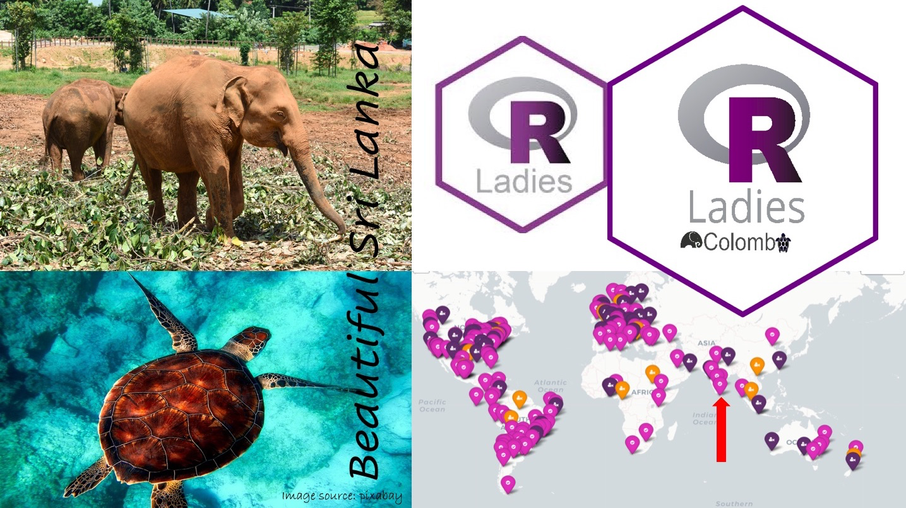

```{r setup, include=FALSE}
library(knitr)
options(htmltools.dir.version = FALSE)
opts_chunk$set(
  warning = FALSE,
  message = FALSE,
  echo = FALSE,
  cache.path = 'cache/',
  fig.align = 'center',
  cache = FALSE
)
library(anicon)

```
```{r xaringan-themer, include=FALSE, warning=FALSE}
library(xaringanthemer)
style_mono_accent(
   base_color = "#002c54",
   title_slide_background_color = "#031642",
  inverse_background_color = "#002c54",
  header_font_google = google_font("Josefin Sans"),
  text_font_google   = google_font("Montserrat", "300", "300i"),
  code_font_google   = google_font("Fira Mono"),
  title_slide_text_color = "#ffea00",
  inverse_header_color = "#ffea00",
   header_background_text_color = "#ffea00",
   text_font_size = "1.2rem",
   text_font_url = "#ffea00",
  header_font_url = "#ffea00",
  inverse_link_color = "#d70dde"
  )
```


class: inverse, middle, center

# Who we are?
---
class: center

.pull-left[

```{r   out.width = "40%", echo = FALSE, fig.cap=''}
knitr::include_graphics("fig/thiyanga2.png")

```

Thiyanga S. Talagala

PhD, Monash University, Australia

Senior Lecturer, University of Sri Jayewardenepura

```{r}
icon::fa("globe")
```
thiyanga.netlify.app

```{r}
icon::fa("github")
icon::fa("twitter")

```
thiyangt

].pull-right[

```{r   out.width = "40%", echo = FALSE, fig.cap='' }
knitr::include_graphics("fig/priyanga2.png")
```

Priyanga D. Talagala

PhD, Monash University, Australia

Senior Lecturer, University of Moratuwa

```{r}

icon::fa("globe")
```
prital.netlify.app

```{r}
icon::fa("github")
icon::fa("twitter")

```
pridiltal
]
--

-  Associate Investigator of the Australian Research Council (ARC) Centre of Excellence for Mathematical and Statistical Frontiers (ACEMS).
--

- Associate Editor for The R Journal (Scimago Journal & Country Rank Q1, ERA ranking A* )

---

class: inverse, middle, center

### Co-founders and co-organizers of R Ladies Colombo

## R-Ladies Global 

```{r   out.width = "20%", echo = FALSE, fig.cap=''}
knitr::include_graphics("fig/globalhexSticker.png")

```

```{r}

icon::fa("globe")
```
https://rladies.org/

```{r}
icon::fa("twitter")
```
RLadiesGlobal

---
background-image:url('fig/talks.jpg')
background-position: 60% 100%
background-size: 100%
class: top, center

.pull-left[
## R-Ladies Global 
### <span style="color:black"> 216 Chapters</span>

### <span style="color:black"> 100267 Members </span>

### <span style="color:black"> 61 Countries</span>
]
.pull-right[
```{r   out.width = "100%", echo = FALSE, fig.cap=''}
knitr::include_graphics("fig/RL.png")

```
<font size="2"> Source: https://benubah.github.io/r-community-explorer/rladies.html</font>
]

---

background-image:url('fig/Rjourney2.png')
background-position: 50% 50%
background-size: 110%
class: top, center, inverse
---
background-image:url('fig/Rjourney1.png')
background-position: 50% 50%
background-size: 110%
class: top, center, inverse
---
class:  middle, center

# Why RLadies Colombo?
```{r   out.width = "80%", echo = FALSE, fig.cap='R-Ladies Across Regions'}
knitr::include_graphics("fig/RL.png")

```
<font size="2"> Source: https://benubah.github.io/r-community-explorer/rladies.html</font>
---

.pull-left[
# R-Ladies Colombo
]
.pull-right[
```{r}

icon::fa("globe")
```
rladiescolombo.netlify.app

```{r}
icon::fa("twitter")
```
RLadiesColombo

```{r}
icon::fa("meetup")
```
www.meetup.com/rladies-colombo/
]

```{r   out.width = "70%", echo = FALSE, fig.cap='R-Ladies Across Regions'}


```
---
class: inverse, middle, center

## Main developer and  the main maintainer of several R packages on CRAN


```{r   out.width = "80%", echo = FALSE, fig.cap='R-Ladies Across Regions'}


```

---
class: inverse, center, middle
# Code of conduct

This workshop series is dedicated to providing a harassment-free experience for <span style="color:#8dcefc"> EVERYONE</span>.

To ensure a <span style="color:#8dcefc"> safe, enjoyable</span> , and <span style="color:#8dcefc"> friendly</span> experience for everyone who participates, we follow the [Workshop Code of Conduct](https://hellormd.netlify.app/2022/10/code-of-conduct/) 

This code of conduct applies to all the spaces, including online workshops, Twitter, mailing lists, both online and offline.

---
class: inverse, middle, center

# Why Learn R?
```{r   out.width = "30%", echo = FALSE, fig.cap=''}
knitr::include_graphics("fig/Rlogo.png")

```
---
.pull-left[

#### `DSjobtracker` R Package (on CRAN, 2020)

DSjobtracker: What Skills and Qualifications are Required for Data Science Related Jobs?

<font size="4">by Statistical Consultancy Service, <br/>
University of Sri Jayewardenepura, 2020
https://thiyangt.github.io/DSjobtracker/
 </font>

```{r   out.width = "50%", echo = FALSE}
knitr::include_graphics("fig/DSjobtrackerhexsticker.png")
```

].pull-right[

#### Top twenty skills required for data science jobs

```{r out.width = "100%"}
library(DSjobtracker)
library(tidyr)
library(magrittr)
library(dplyr)
library(ggplot2)
library(viridis)
library(forcats)

theme_set(theme_minimal())

skills_long <- DStidy %>%
  select(c(R:Bahasa_Malaysia)) %>%
  pivot_longer(c(R:Bahasa_Malaysia), values_to = "Value", names_to = "Name") %>%
  mutate(Value = as.numeric(levels(Value))[Value]) %>%
  group_by(Name) %>%
  summarize(Total = sum(Value)) %>%
  arrange(Total)

p<- skills_long %>%
  mutate(Name = factor(Name, levels = .$Name)) %>%
  top_n(20) %>%
  ggplot(aes(x = Name, y = Total)) +
  geom_bar(stat = "identity") +
  geom_label(aes(label = Total),
    nudge_y = -10, size = 5,
    label.padding = unit(0.125, "lines")
  ) +
  coord_flip() +
  labs(
    x = "Skill Required", y = "No of job vacancies"
  )+
  theme(text = element_text(size=20))

print (p)
```
]
<!--Both of these datasets contain information about job vacancies related to data science-->
---


class: inverse, middle, center

# R Vs Python 

---
class: inverse, middle, center


# ~~R Vs Python~~

# R AND Python 
--

```{r out.width = "40%"}
library(tibble)
library(tidyverse)
skills <- c("R and Python", "Python only", "Other Statistical SW", "R, SAS & Python only", "SAS only" )
count <- c(124,91,67,26,13)
data <- tibble(skills, count)


p<- data %>%
  ggplot(aes(x = reorder(skills, count) , y = count)) +
  geom_bar(stat = "identity") +
  geom_label(aes(label = count),
    nudge_y = -10, size = 5,
    label.padding = unit(0.125, "lines")
  ) +
  coord_flip() +
  labs(
    x = "Skill Required", y = "No of  advertisements"
  )+
  theme(text = element_text(size=20))
print(p)
```
---
class: inverse, middle, center


# ~~R Vs Python~~

# R AND Python 

#  <span style="color:SkyBlue">Stay</span> <span style="color:orange">TUNED !!</span> 
<!--`r anicon::faa("bell", animate="ring", size =1.5, speed = "fast")`
-->

.pull-left[

```{r   out.width = "25%", echo = FALSE, fig.cap=''}
knitr::include_graphics("fig/Rlogo.png")

```

 +
```{r   out.width = "35%", echo = FALSE, fig.cap=''}
knitr::include_graphics("fig/python.png")

```

].pull-right[

```{r}
anicon::cia("fig/quarto.png", animate="wrench",
            grow=40, border=T, bgcolor="#9BB1FF")

```
]


---
background-image:url('fig/tidyworkflow1.png')
background-position: 60% 80%
background-size: 85%
class: top, center
# Tidy Workflow
---
background-image:url('fig/tidyworkflow2.png')
background-position: 60% 80%
background-size: 85%
class: top, center

# Tidy Workflow

---
class: inverse, middle, center

## Reproducible Research

```{r   out.width = "90%", echo = FALSE, fig.cap=''}


```
---
class: inverse, middle, center

# Reproducible Research

"Reproducibility refers to the ability of a researcher to duplicate the results of a prior study using the <span style="color:red"> same materials </span> (data, software code, etc.) as were used by the original investigator. That is, a second researcher might use the same raw data to build the same analysis files and implement the same statistical analysis in an attempt to yield the same results....

<span style="color:red"> Reproducibility is a minimum necessary condition for a finding to be believable and informative. </span>”

   - U.S. National Science Foundation (NSF) subcommittee on replicability in science - 

<font size="4">Source: Goodman, Steven N, Daniele Fanelli, and John P A Ioannidis. 2016. “What does research reproducibility mean?” Science Translational Medicine 8 (341): 1–6. https://doi.org/10.1126/scitranslmed.aaf5027.</font>

---

# Traditional approach to writing reports*

- Import data set into statistical software package

- Run the procedure to get results

- Copy & paste appropriate pieces from the analysis into editor

- Add descriptions

- Finish/submit report

.footnote[ Source: https://ismayc.github.io/talks/thesisdown17/slides.html#1]


---

## Disadvantages of this process *

- Lots of manual work (prone to make errors)

--

- Tedious (who likes to carefully copy-and-paste?)

--

- Likely not recordable (did you write down all the steps you followed to get your analysis?) (Articles that may require revisions)

--

- What if you made an error at the beginning of your analysis? If your data had an error?

--

- Tech companies are moving more and more towards reproducible research/analysis to help with employee turnover

.footnote[ Source: https://ismayc.github.io/talks/thesisdown17/slides.html#1]
---


class: inverse, middle, center

.pull-left[
# Reproducibility crisis

"...Reproducibility crisis is an ongoing methodological crisis in which it has been found that the results of many scientific studies are difficult or impossible to reproduce. 

...Because the reproducibility of empirical results is an essential part of the scientific method, such failures undermine the credibility of theories building on them and potentially call into question substantial parts of scientific knowledge..."

           -  Wikipedia, 2022
           
<font size="4"> Ioannidis, J. P. (2005). Why most published research findings are false. PLoS medicine, 2(8), e124.</font>
].pull-right[

```{r   out.width = "90%", echo = FALSE, fig.cap=''}


```


]
---

## Reproducible Research

### Methods Reproducibility

  The provision of enough detail about **study procedures** and **data** so the same procedures could be exactly repeated with the same data
  
### Results Reproducibility 

   Obtaining the same results from the conduct of an independent study whose **procedures are as closely matched** to the original experiment as possible with **independent data**
   
### Inferential Reproducibility 

  Drawing of qualitatively **similar conclusions** from either an independent replication of a study or a reanalysis of the original study

<!-- Of these, we are most interested in methods reproducibility for the purposes of this chapter. That is, we will discuss how R can help you, as a researcher, improve in this aspect of reproducibilit
-->

.footnote[https://tysonbarrett.com/Rstats/chapter-9-reproducible-workflow-with-rmarkdown.html]

---
class: inverse, middle center


```{r   out.width = "30%", echo = FALSE, fig.cap=''}
knitr::include_graphics("fig/rmarkdown.png")
```

---

class: inverse, middle, center

```{r}
icon::fa("twitter")
```
<blockquote class="twitter-tweet"><p lang="en" dir="ltr">I haven’t even heard of latex or markdown, makes me feel a tad old 😢</p>&mdash; Oscar Jonsson (@OAJonsson) <a href="https://twitter.com/OAJonsson/status/1162473463174635520?ref_src=twsrc%5Etfw">August 16, 2019</a></blockquote> <script async src="https://platform.twitter.com/widgets.js" charset="utf-8"></script>


---
class: inverse, middle, center

```{r}
icon::fa("twitter")
```

.pull-left[

<blockquote class="twitter-tweet"><p lang="en" dir="ltr">I also wrote my recent <a href="https://twitter.com/OReillyMedia?ref_src=twsrc%5Etfw">@OReillyMedia</a> book in Jupyter notebooks: <a href="https://t.co/YOvGLm9dxu">https://t.co/YOvGLm9dxu</a><br><br>I wouldn&#39;t say it&#39;s the best option for &quot;formal&quot; publishing—I&#39;d prefer something closer to rmarkdown / bookdown—but Jupyter certainly worked well enough for me!</p>&mdash; Jake VanderPlas (@jakevdp) <a href="https://twitter.com/jakevdp/status/948943224390889473?ref_src=twsrc%5Etfw">January 4, 2018</a></blockquote> <script async src="https://platform.twitter.com/widgets.js" charset="utf-8"></script>
] .pull-right[
```{r   out.width = "80%", echo = FALSE, fig.cap=''}
knitr::include_graphics("fig/PDSH-cover.png")
```
]
---
class: inverse, middle, center

```{r}
icon::fa("twitter")
```
<blockquote class="twitter-tweet"><p lang="en" dir="ltr">Plus you can mix up multiple languages in single Rmd if you need to. I don&#39;t think that is possible with Jupyter. You can even exchange data between python and R using the reticulate package.</p>&mdash; Jerry Thomas (@jerrythomas_in) <a href="https://twitter.com/jerrythomas_in/status/1030691102624382976?ref_src=twsrc%5Etfw">August 18, 2018</a></blockquote> <script async src="https://platform.twitter.com/widgets.js" charset="utf-8"></script>

---

class: inverse, middle center

# Buckle Up!


```{r   out.width = "23%", echo = FALSE, fig.cap=''}
knitr::include_graphics("fig/rmarkdown.png")
```
--

## Take down, Note down, Write down, Jot down
--

## R Markdown


