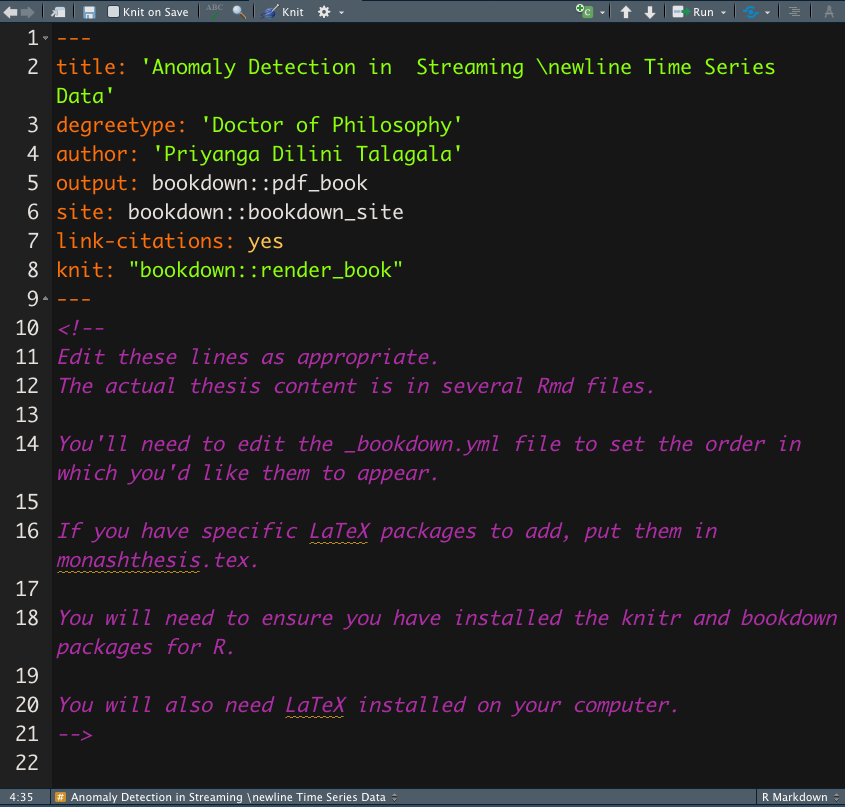

```{r setup, include=FALSE}
library(knitr)
options(htmltools.dir.version = FALSE)
opts_chunk$set(
  warning = FALSE,
  message = FALSE,
  echo = FALSE,
  cache.path = 'cache/',
  fig.align = 'center',
  cache = FALSE
)
library(anicon)

```
```{r xaringan-themer, include=FALSE, warning=FALSE}
library(xaringanthemer)
style_mono_accent(
   base_color = "#002c54",
   title_slide_background_color = "#031642",
  inverse_background_color = "#002c54",
  header_font_google = google_font("Josefin Sans"),
  text_font_google   = google_font("Montserrat", "300", "300i"),
  code_font_google   = google_font("Fira Mono"),
  title_slide_text_color = "#ffea00",
  inverse_header_color = "#ffea00",
   header_background_text_color = "#ffea00",
   text_font_size = "1.2rem",
   text_font_url = "#ffea00",
  header_font_url = "#ffea00",
  inverse_link_color = "#d70dde"
  )
```

class: inverse, middle, center
# bookdown R package

```{r   out.width = "20%", echo = FALSE, fig.cap=''}
knitr::include_graphics("fig/bookdown.png")

```

- A open-source R package to facilitate writing books and long-form articles/reports with R Markdown.

- Generate printer-ready books and ebooks from R Markdown documents
]
---
class: inverse, middle, center
.pull-left[
```{r   out.width = "85%", echo = FALSE, fig.cap=''}
knitr::include_graphics("fig/prithesis.png")

```
].pull-right[

```{r   out.width = "100%", echo = FALSE, fig.cap=''}


```
]

---

class: inverse, middle, center

.pull-left[
```{r   out.width = "75%", echo = FALSE, fig.cap=''}
knitr::include_graphics("fig/bookdowncover.jpeg")

```
].pull-right[
## Learn more about bookdown:

https://pkgs.rstudio.com/bookdown/


```{r   out.width = "50%", echo = FALSE, fig.cap=''}
knitr::include_graphics("fig/bookdown.png")

```

You can install the package from CRAN as follows:

install.packages("bookdown")
]

---

class: inverse, middle, center

# thesisdown

```{r   out.width = "35%", echo = FALSE, fig.cap=''}
knitr::include_graphics("fig/thesisdownlogo1.png")

```