```{r setup, include=FALSE}
library(knitr)
options(htmltools.dir.version = FALSE)
opts_chunk$set(
  warning = FALSE,
  message = FALSE,
  echo = FALSE,
  cache.path = 'cache/',
  fig.align = 'center',
  cache = FALSE
)
library(anicon)

```
```{r xaringan-themer, include=FALSE, warning=FALSE}
library(xaringanthemer)
style_mono_accent(
   base_color = "#002c54",
   title_slide_background_color = "#031642",
  inverse_background_color = "#002c54",
  header_font_google = google_font("Josefin Sans"),
  text_font_google   = google_font("Montserrat", "300", "300i"),
  code_font_google   = google_font("Fira Mono"),
  title_slide_text_color = "#ffea00",
  inverse_header_color = "#ffea00",
   header_background_text_color = "#ffea00",
   text_font_size = "1.2rem",
   text_font_url = "#ffea00",
  header_font_url = "#ffea00",
  inverse_link_color = "#d70dde"
  )
```

class: inverse, middle, center
# rticle R package

```{r   out.width = "20%", echo = FALSE, fig.cap=''}
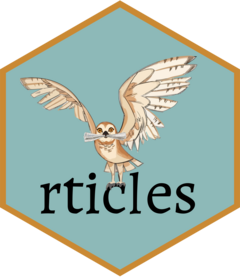

```

The rticles R package provides a suite of custom R Markdown LaTeX formats and templates for authoring journal articles and conference submissions. 
---

.pull-left[

```{r   out.width = "100%", echo = FALSE, fig.cap=''}
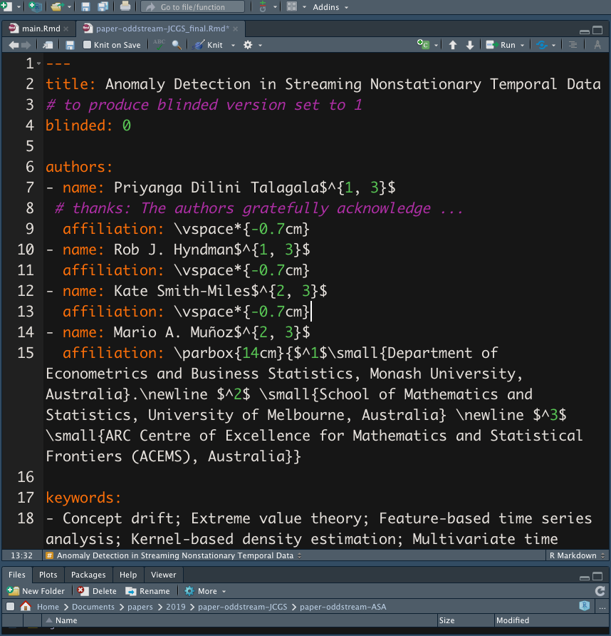

```

].pull-right[

```{r   out.width = "100%", echo = FALSE, fig.cap=''}
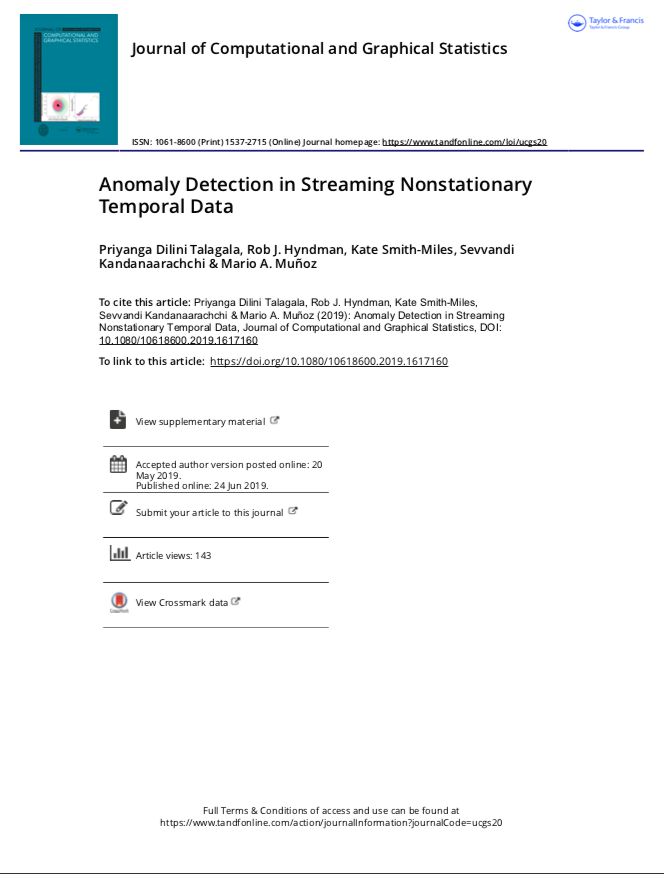

```

]

.footnote[ ERA ranking A* Journal, SJR Q1]

---
# JCGS - Instructions for authors

```{r   out.width = "100%", echo = FALSE, fig.cap=''}
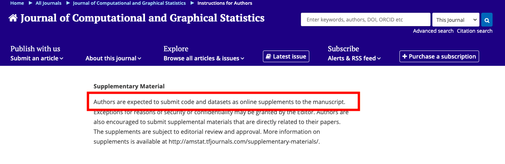

```
---
class: middle

.pull-left[
```{r   out.width = "100%", echo = FALSE, fig.cap=''}
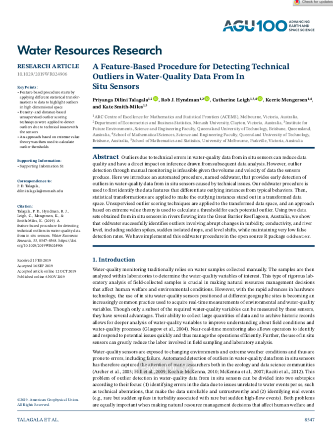

```

].pull-right[

- ERA ranking A* Journal, SJR Q1

- *"...I applaud the authors for making the code available in GitHub and for including the datasets used in this paper along with their code. That’s a nice touch...."*
]
---
## Installation

You can install and use rticles from CRAN as follows:

`install.packages("rticles")`

--

## Templates

- Different journal templates are available through the R package `rticle`.

https://github.com/rstudio/rticles#templates


--

- You can also get the list of available journal names with `rticles::journals()`.

---
## Using rticles

File -> New File -> R Markdown.

```{r   out.width = "50%", echo = FALSE, fig.cap=''}
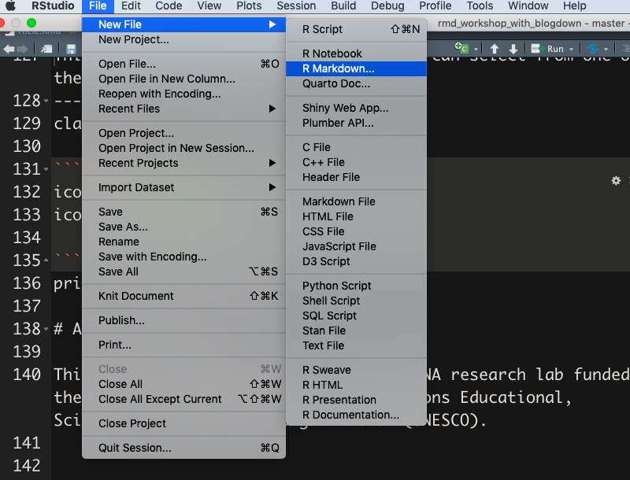

```

---
It will open the dialog box where you can select from one of the available templates:

Example 1: Journal of Open Source Software Article

```{r   out.width = "50%", echo = FALSE, fig.cap=''}
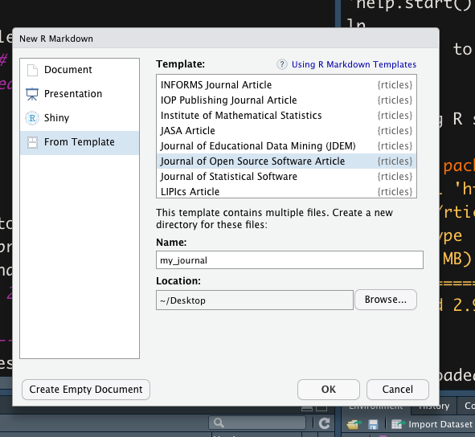

```

---
## Directory structure

Example 1: Journal of Open Source Software Article

```{r   out.width = "100%", echo = FALSE, fig.cap=''}
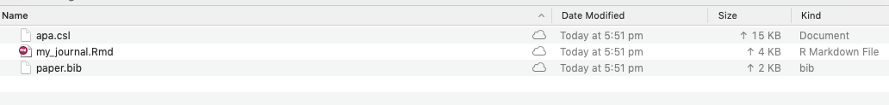

```

---
## Example 1: Journal of Open Source Software Article

```{r   out.width = "90%", echo = FALSE, fig.cap=''}
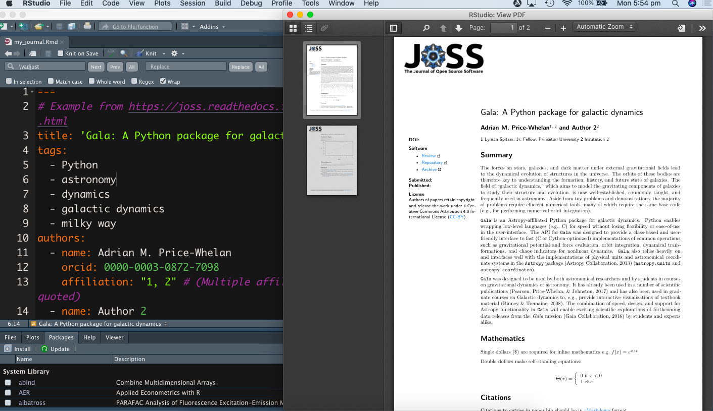

```


---
## Example 1: Journal of Open Source Software Article

```{r   out.width = "90%", echo = FALSE, fig.cap=''}
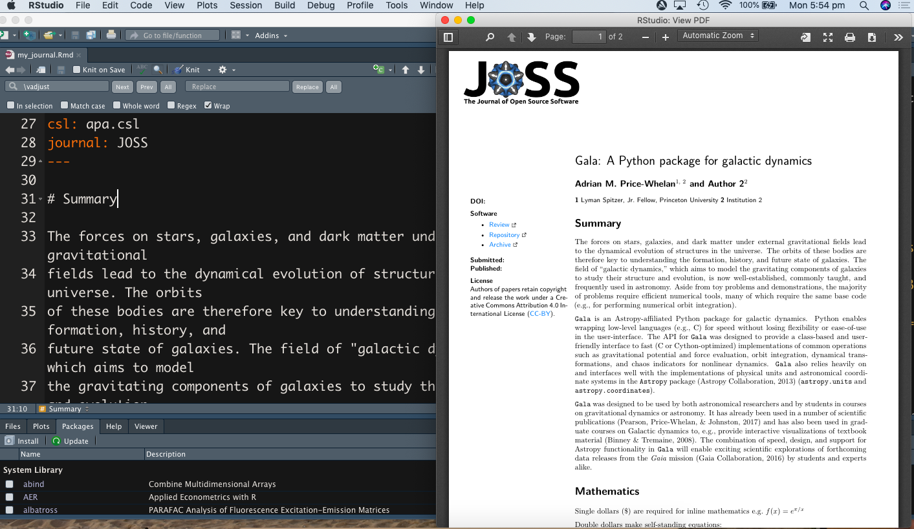

```


---

## Directory structure

Example 1: Journal of Open Source Software Article

```{r   out.width = "100%", echo = FALSE, fig.cap=''}
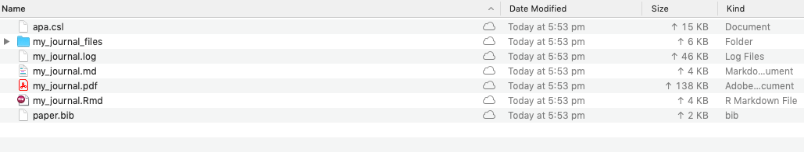

```

---

## Example 2: IEEE Transactions Journal Article

```{r   out.width = "50%", echo = FALSE, fig.cap=''}
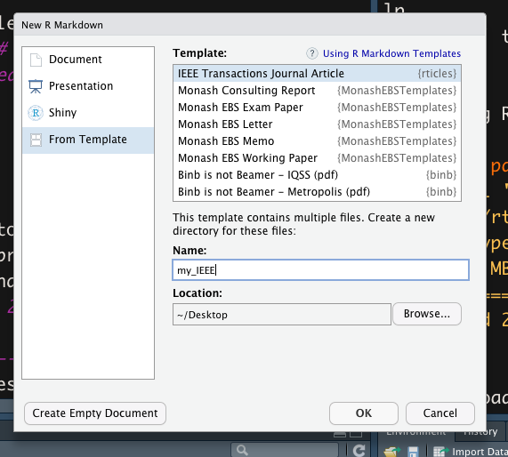

```

---
## Example 2: IEEE Transactions Journal Article

```{r   out.width = "80%", echo = FALSE, fig.cap=''}
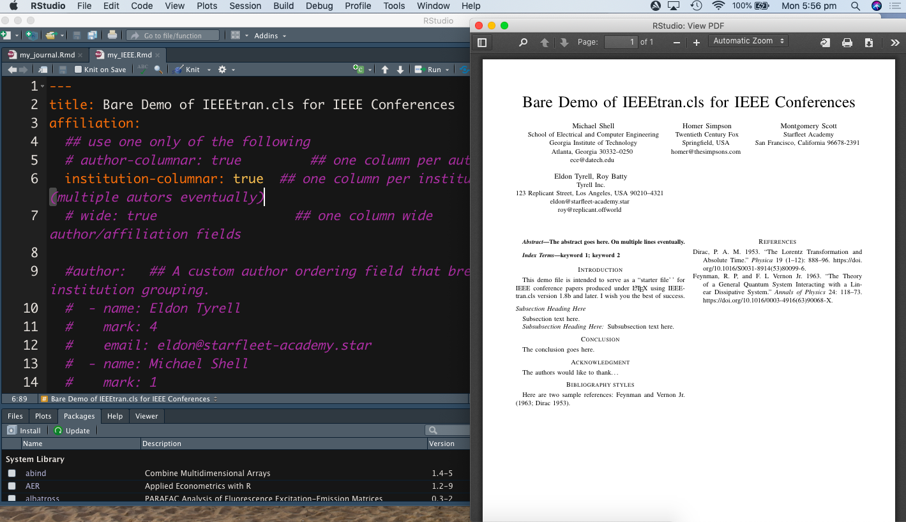

```

---
## Example 2: IEEE Transactions Journal Article

```{r   out.width = "80%", echo = FALSE, fig.cap=''}
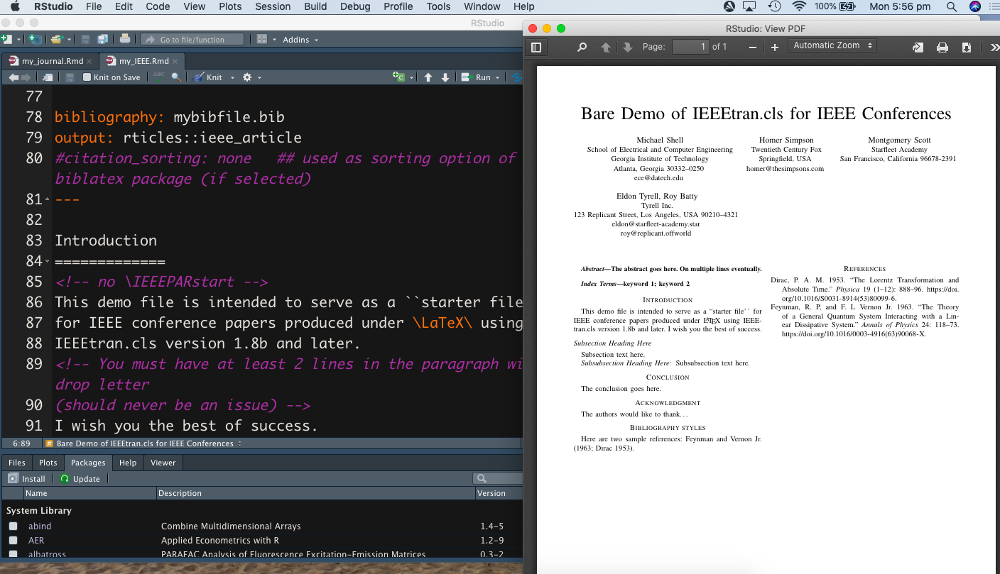

```
---
## Directory structure

Example 2: IEEE Transactions Journal Article

```{r   out.width = "100%", echo = FALSE, fig.cap=''}
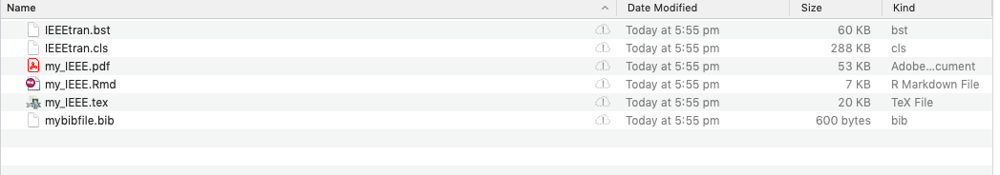

```

---
class: inverse, middle, center

```{r}
icon::fa("github")
icon::fa("twitter")

```
pridiltal and thiyangt

# Acknowledgements:

This work was supported in part by RETINA research lab funded by the OWSD, a program unit of United Nations Educational, Scientific and Cultural Organization (UNESCO).


All rights reserved by Thiyanga S. Talagala and Priyanga D Talagala


