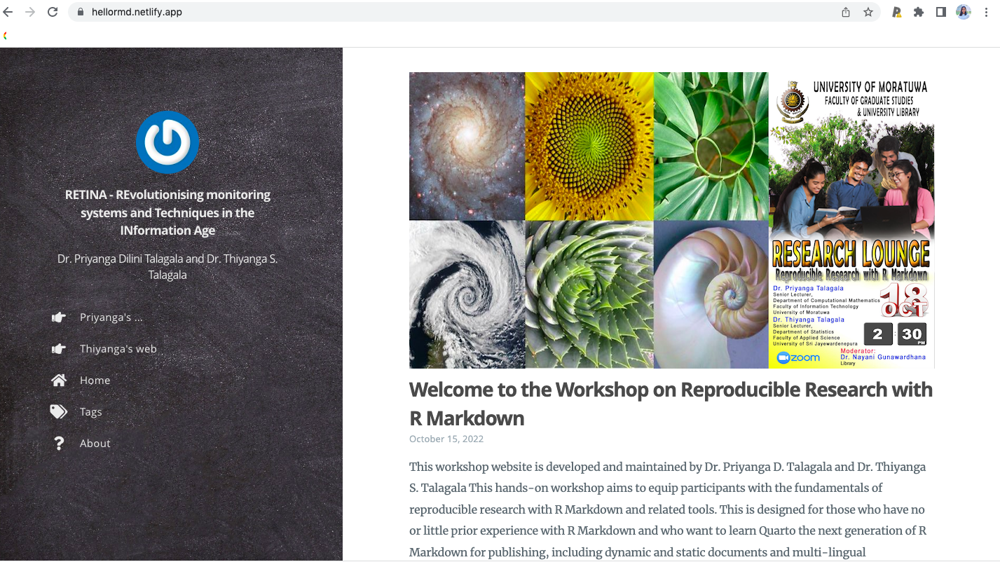
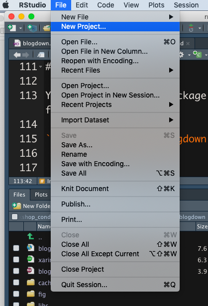
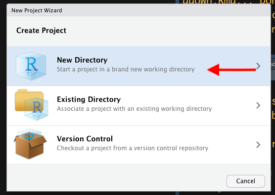
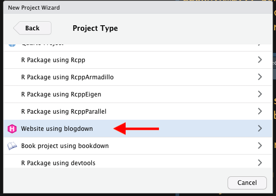
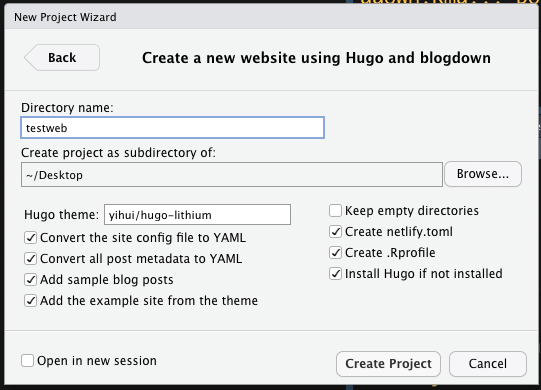
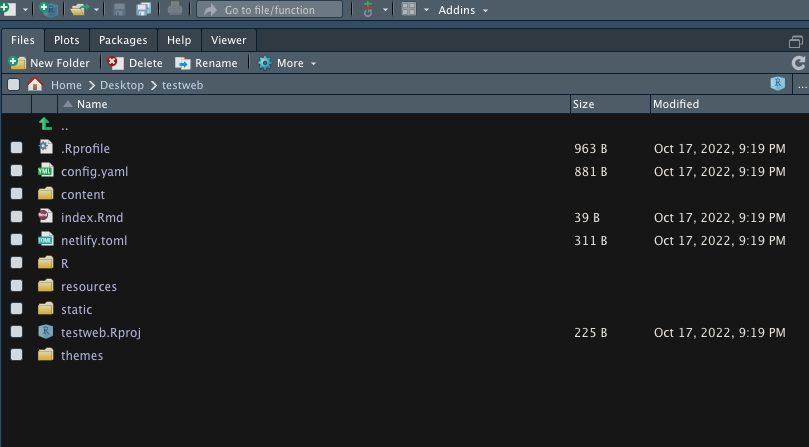
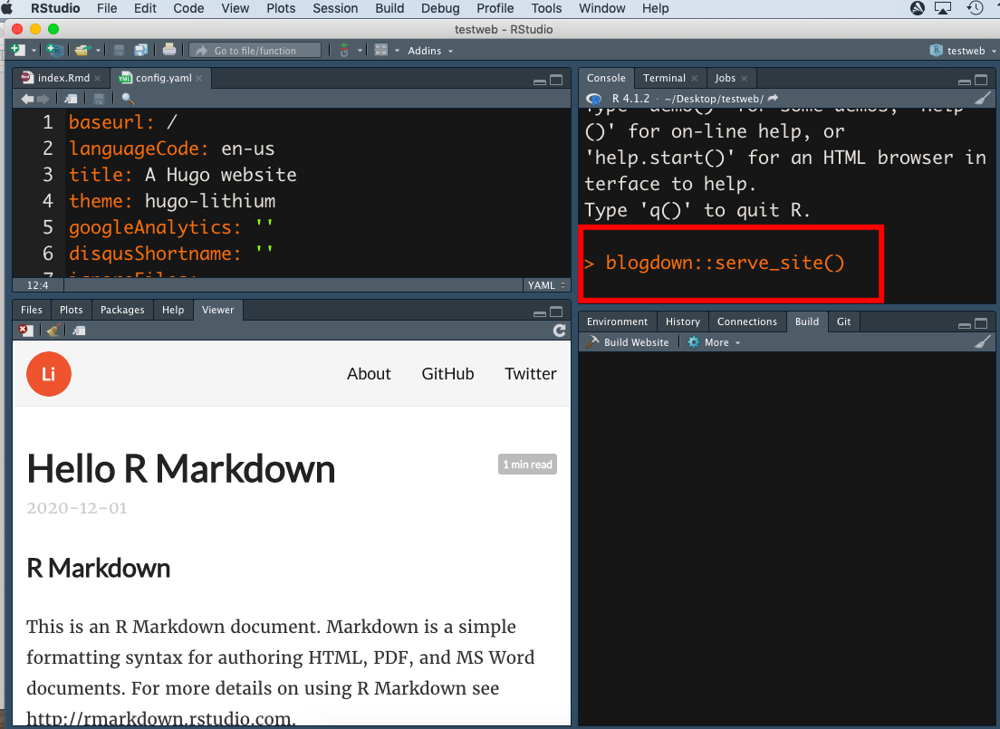
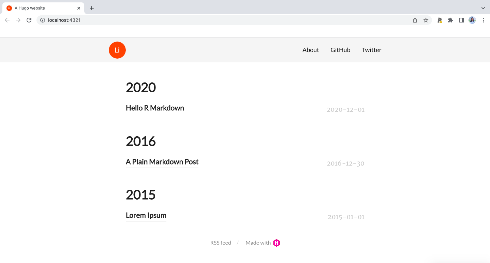
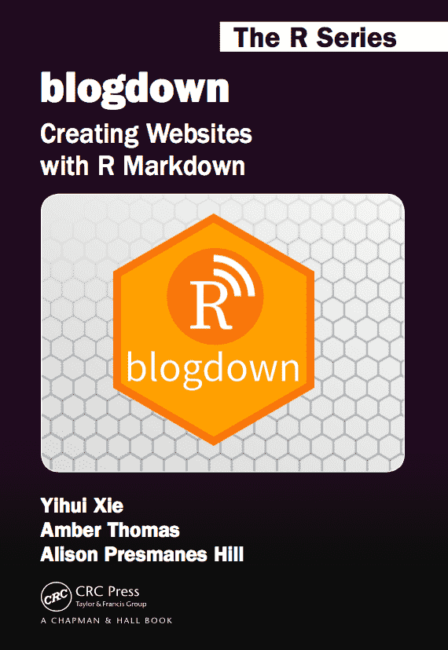
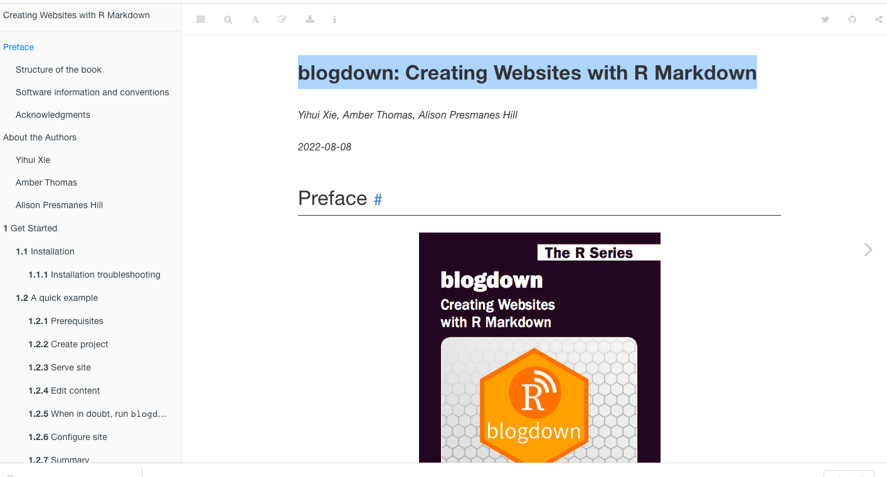

```{r setup, include=FALSE}
library(knitr)
options(htmltools.dir.version = FALSE)
opts_chunk$set(
  warning = FALSE,
  message = FALSE,
  echo = FALSE,
  cache.path = 'cache/',
  fig.align = 'center',
  cache = FALSE
)
library(anicon)

```
```{r xaringan-themer, include=FALSE, warning=FALSE}
library(xaringanthemer)
style_mono_accent(
   base_color = "#002c54",
   title_slide_background_color = "#031642",
  inverse_background_color = "#002c54",
  header_font_google = google_font("Josefin Sans"),
  text_font_google   = google_font("Montserrat", "300", "300i"),
  code_font_google   = google_font("Fira Mono"),
  title_slide_text_color = "#ffea00",
  inverse_header_color = "#ffea00",
   header_background_text_color = "#ffea00",
   text_font_size = "1.2rem",
   text_font_url = "#ffea00",
  header_font_url = "#ffea00",
  inverse_link_color = "#d70dde"
  )
```


## Research blogging

- Research blogging is a form of knowledge mobilization that can help get the right information to the right people at the right time.

--

- Blogging your research can reduce research waste, improve access, build awareness, and increase connections.

--
- Encourage you to express your ideas, be creative, develop confidence in writing, to communicate and collaborate with other.

--

- Work on your online presence and become reflective in your learning 

.footnote[Source: Blogging your research: Tips for getting started https://www.lib.sfu.ca/help/publish/scholarly-publishing/radical-access/blogging-research#:~:text=Research%20blogging%20is%20a%20form,build%20awareness%2C%20and%20increase%20connections.]
---
##  Deciding where to blog


- The best place to start blogging will depend on your time, budget, skills, experience, and goals.

- A few common options include:

   - **Create your own blog:** If you plan to do a lot of blogging, consider starting your own website
   
   - **Blog on a third-party platform:** If you only plan to blog from time to time, posting on a third-party site can be a good option
   
.footnote[Source: Blogging your research: Tips for getting started https://www.lib.sfu.ca/help/publish/scholarly-publishing/radical-access/blogging-research#:~:text=Research%20blogging%20is%20a%20form,build%20awareness%2C%20and%20increase%20connections.]
---
class: inverse, middle, center

## Create your own blog with

```{r   out.width = "30%", echo = FALSE, fig.cap=''}
knitr::include_graphics("fig/logo.png")

```

---
## Blogdown

- `blogdown` allows you  to create websites using R Markdown and Hugo.

- By default, blogdown uses Hugo, a popular open-source static website generator, which provides a fast and flexible way to build your site content to be shared online.

- Other website generators like Jekyll and Hexo are also supported.

---
#### Research Lounge website 

[hellormd.netlify.app](https://hellormd.netlify.app/)

```{r   out.width = "80%", echo = FALSE, fig.cap=''}


```
---

## Installation

You can install the package via CRAN as follows:

`install.packages('blogdown')`

---

## Creating websites with blogdown

File -> New Project 

```{r   out.width = "40%", echo = FALSE, fig.cap=''}


```
---

## Creating websites with blogdown

 New Directory 
 
```{r   out.width = "60%", echo = FALSE, fig.cap=''}


```
---

## Creating websites with blogdown

 Website using blogdown
 
```{r   out.width = "60%", echo = FALSE, fig.cap=''}


```
---
## Creating websites with blogdown

```{r   out.width = "60%", echo = FALSE, fig.cap=''}


```
---
## Directory structure

```{r   out.width = "90%", echo = FALSE, fig.cap=''}


```
---
## Creating websites with blogdown

```{r   out.width = "65%", echo = FALSE, fig.cap=''}


```
---
## Creating websites with blogdown

```{r   out.width = "80%", echo = FALSE, fig.cap=''}


```
---

<!--
You may not be satisfied with the default site created from the default setting-->

# Advanced features

.pull-left[

```{r   out.width = "60%", echo = FALSE, fig.cap=''}


```
].pull-right[

https://bookdown.org/yihui/blogdown/

```{r   out.width = "100%", echo = FALSE, fig.cap=''}


```
]


---
class: inverse, middle, center

```{r}
icon::fa("github")
icon::fa("twitter")

```
pridiltal and thiyangt

# Acknowledgements:

This work was supported in part by RETINA research lab funded by the OWSD, a program unit of United Nations Educational, Scientific and Cultural Organization (UNESCO).


All rights reserved by Thiyanga S. Talagala and Priyanga D Talagala


